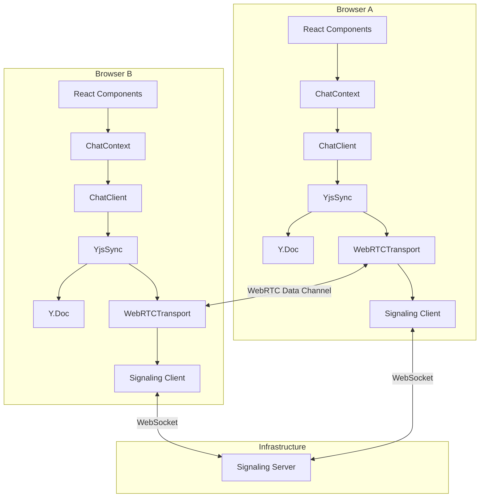

# Chat System

Peer-to-peer chat using WebRTC data channels and Y.js CRDTs for state synchronization.

## Architecture

## Components

| Component | Location | Purpose |
|-----------|----------|---------|
| ChatClient | `services/chat/ChatClient.ts` | Singleton managing connection lifecycle, Y.js doc, and state |
| YjsSync | `services/sync/YjsSync.ts` | Syncs Y.Doc across peers via transport; handles awareness |
| WebRTCTransport | `services/transport/WebRTCTransport.ts` | Implements PeerTransport using WebRTC data channels |
| Signaling Client | `services/webrtc/Signaling.ts` | WebSocket connection to signaling server for peer discovery and SDP/ICE exchange |
| ChatContext | `contexts/ChatContext.tsx` | React context that subscribes to ChatClient state |

## Data Model (Y.js CRDTs)

- **channels** (`Y.Map<ChatChannel>`) — Channel metadata keyed by channel ID
- **messages** (`Y.Map<Y.Array<ChatMessage>>`) — Messages per channel, keyed by channel ID

Each message contains: `id`, `channelId`, `authorId`, `authorName`, `body`, `timestamp`

## Sync Protocol

Messages sent over WebRTC data channels:

| Type | ID | Description |
|------|-----|-------------|
| SYNC_REQUEST | 0 | Request full Y.Doc state from peer |
| SYNC_RESPONSE | 1 | Full Y.Doc state as response |
| UPDATE | 2 | Incremental Y.Doc update |
| AWARENESS | 3 | User presence (JSON: peerId, name, id) |

## Awareness (Presence)

User presence is tracked via a lightweight awareness protocol:

1. On peer connect: broadcast awareness with JWT username
2. Periodic heartbeat every 15 seconds
3. On peer disconnect: remove from member list
4. Deduplicated by JWT user ID (not peer ID)

## Connection Flow

1. User authenticates via WebAuthn → JWT cookie set
2. ChatClient auto-connects on Dashboard mount
3. Fetches username from `/v1/me` endpoint
4. Connects to signaling server WebSocket at `/ws/{topic}`
5. Signaling server assigns peer ID and broadcasts peer list
6. WebRTC peer connections established with existing peers
7. Data channels open → Y.js sync begins
8. Default "general" channel created if none exist

## Environment Variables

| Variable | Default | Description |
|----------|---------|-------------|
| `VITE_SIGNALING_URL` | `ws://localhost:8081` | Signaling server WebSocket URL |
| `VITE_CHAT_TOPIC` | `lanscape-chat` | Topic/room name for peer discovery |

## Design Decisions

- **Singleton ChatClient**: Prevents React Strict Mode double-renders from creating duplicate connections
- **Transport abstraction**: `PeerTransport` interface allows swapping WebRTC for other transports
- **Y.js for state**: CRDTs enable conflict-free merging without central coordination
- **Awareness vs CRDT**: Presence uses ephemeral awareness protocol, not persisted in Y.Doc
- **No message history**: Messages only synced between currently connected peers (persistence TBD)

